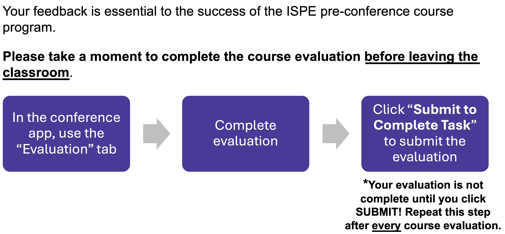

```{r}
library(googlesheets4)
library(gt)
library(dplyr)
library(here)
library(webshot2)
```

# Welcome to ICPE 2025

## Meet Your Faculty

::: {.column width="25%"}
Janick Weberpals, <br> RPh, PhD
{width="91%"}
Associate Director, Oncology Data Science & AI, AstraZeneca
:::

::: {.column width="25%"}
Shirley Wang, <br> PhD

Associate Professor, Brigham & Women's Hospital, Harvard Medical School
:::

::: {.column width="25%"}
Anna Schultz <br> PhD, MSc

Assistant Professor, London School for Hygiene and Tropical Medicine
:::

::: {.column width="25%"}
John Tazare, <br> PhD

Assistant Professor, London School for Hygiene and Tropical Medicine
:::

## Disclosures

::: callout-important
## Disclosure

- JW is an employee at AstraZeneca and own shares in AstraZeneca. The views and opinions expressed in this presentation are those of the author and do not necessarily reflect the official policy or position of AstraZeneca. The author is presenting in a personal capacity.
- SVW has been an ad hoc consultant to Cytel Inc, MITRE a federally funded research and development center for the Centers for Medicare and Medicaid Services, and the ACI Group for unrelated work.
- AS is employed by LSHTM on a research grant funded by GSK. 
- JT has no disclosures.
:::

# Warm up survey {visibility="hidden"}

## What is your background? {visibility="hidden"}

-   Epidemiology
-   Biostatistics
-   Pharmacy/Pharmacology
-   Medicine
-   Health Services Research
-   Computer Science
-   Other

## Which sector are you working in? {visibility="hidden"}

-   Academia
-   Industry
-   Regulatory/HTA
-   Tech
-   Other

## How far did you have to travel to D.C.? {visibility="hidden"}

-   North America
-   South America
-   Europe
-   Middle East
-   Asia
-   Africa
-   Oceania

## Have you ever worked with git or any other system to version-control your analytic code? {visibility="hidden"}

-   Yes
-   No

## Have you ever shared your own code via git? {visibility="hidden"}

-   Yes
-   No

## Have you ever re-used someone else's code? {visibility="hidden"}

-   Yes
-   No

# Introduction to the topic

## Transparency and reproducibility standards across the RWE lifecycle {.small}

::: columns

::: {.column width="33%"}
**Study conceptualization** and pre-specification using HARPER [@wang2022harmonized] 

{#fig-harper}
:::

::: {.column .fragment width="33%"}
**Study implementation** <br> guidelines, training and engagement are lacking in non-interventional healthcare research community 

{#fig-implementation width=30%}
:::

::: {.column width="33%"}
**Study reporting** <br> guidelines like [RECORD(-PE)](https://www.record-statement.org) [@benchimol2015reporting] and [STROBE](https://www.strobe-statement.org) [@von2014strengthening]

{#fig-record width=60%}

{#fig-strobe width=30%}
:::

:::

## Our agenda today

```{r}
#| label: tbl-timetable
#| tbl-cap: "Course timetable."
#| message: false
#| echo: false

gs4_deauth()
tbl_schedule <- read_sheet(
  ss = Sys.getenv("timetable_url")
  ) |> 
  mutate(across(c(Start, End), ~ format(as.POSIXct(.x, format = "%H:%M"), format = "%H:%M"))) |>
  mutate(Time = paste0(Start, " - ", End)) |>
  relocate(Time, .before = Topic) |>
  select(-c(Duration, Start, End)) |> 
  gt() |> 
  cols_align(align = "left") |> 
  cols_width(
    Description ~ px(500),
    everything() ~ px(150)
    )

gtsave(
  data = tbl_schedule, 
  filename = here("images", "tbl_schedule.png")
  )

knitr::include_graphics(here("images", "tbl_schedule.png"))
```

## Course materials

You can find all course materials, setup instructions and further useful resources at:

[https://janickweberpals.github.io/icpe-git-2025/](https://janickweberpals.github.io/icpe-git-2025/)

.](images/course_materials.png){#fig-course-materials}

## PDS Special Issue

1099-1557.research-reproducibility) [@wang2025advancing]](images/pds_special_issue.png){#fig-pds-special}

## Technical Setup

{#fig-qr}

## Important: Course evaluation

{#fig-evlaution}

## Course focus

::: incremental

::: callout-tip
## What this course is about
- Giving recommendations on how to enhance transparency and reproducibility across different stages of a RWE study implementation
- What to consider when pre-specifying your study design and analyses
- Version control of analytic code and computational reproducibility
- Making your study report more transparent to others & future you
:::

::: callout-important

## What this course is NOT about
- Any specific programming language
- Statistical programming language bootcamp
- Any specific study design or statistical analysis considerations
:::

:::

## Why is this important?

Increasing expectations and policies from various stakeholders regarding the provenance, sharing and audit trial of study documents including analytic code

- **Regulatory**

>"Sponsors should ensure that RWD and associated programming codes and algorithms submitted to FDA are documented, well-annotated, and complete, which would allow FDA to replicate the study analysis using the same dataset and analytic approach" (FDA [@FDA2023RWD])

- **Publishing**

>"We will make code sharing mandatory too." (BMJ [@BMJ2023DataSharing])

## References

::: ref
:::
