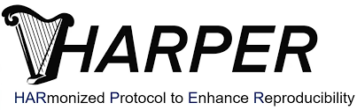
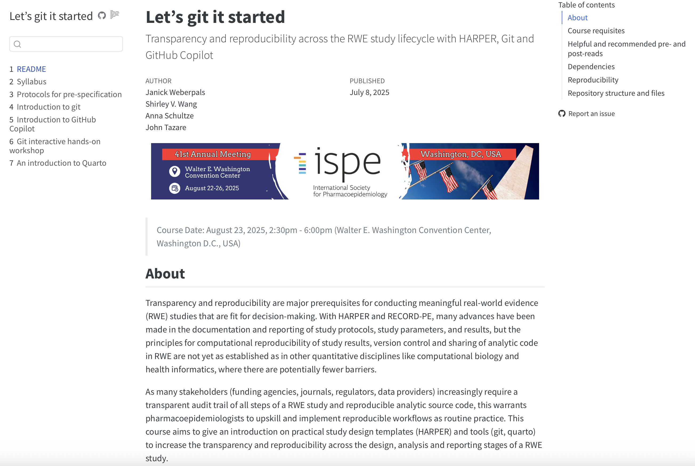

```{r}
library(googlesheets4)
library(gt)
library(dplyr)
```

# Welcome to ICPE 2025

## That's me (Janick Weberpals)

-   Associate Director, R&D Oncology Data Science & AI, AstraZeneca

-   Background: Pharmacy (RPh), Epidemiology (PhD), Data Science (Postdoc)

-   Research interest: Anything in and close to my skillset to eliminate cancer as a cause of death

-   Prior affiliations: UF, DKFZ, Roche, Brigham & Women's Hospital and Harvard Medical School

::: callout-important
## Disclosure

I'm an employee at AstraZeneca and own shares in AstraZeneca. The views and opinions expressed in this presentation are those of the author and do not necessarily reflect the official policy or position of AstraZeneca. The author is presenting in a personal capacity.

I don't own any shares in Microsoft or other products that are discussed as part of this pre-conference course.
:::

# Warm up survey

## What is your background?

-   Epidemiology
-   Biostatistics
-   Pharmacy/Pharmacology
-   Medicine
-   Health Services Research
-   Computer Science
-   Other

## Which sector are you working in?

-   Academia
-   Industry
-   Regulatory/HTA
-   Tech
-   Other

## How far did you have to travel to D.C.?

-   North America
-   South America
-   Europe
-   Middle East
-   Asia
-   Africa
-   Oceania

## Have you ever worked with git or any other system to version-control your analytic code?

-   Yes
-   No

## Have you ever shared your own code via git?

-   Yes
-   No

## Have you ever re-used someone else's code?

-   Yes
-   No

# Introduction to the topic

## Transparency and reproducibility standards across the RWE lifecycle

::: columns

::: {.column width="33%"}
**Study conceptualization** and pre-specification using HARPER [@wang2022harmonized] 

{#fig-harper}
:::

::: {.column .fragment width="33%"}
**Study implementation** <br> guidelines, training and engagement are lacking in non-interventional healthcare research community 

{#fig-implementation}
:::

::: {.column width="33%"}
**Study reporting** <br> guidelines like [RECORD(-PE)](https://www.record-statement.org) and [STROBE](https://www.strobe-statement.org)

{#fig-record} 
{#fig-strobe}
:::

:::

## Our agenda today

```{r}
#| label: tbl-timetable
#| tbl-cap: "Detailed course timetable."
#| message: false
#| echo: false

gs4_deauth()
read_sheet(
  ss = Sys.getenv("timetable_url")
  ) |> 
  mutate(across(c(Start, End), ~ format(as.POSIXct(.x, format = "%H:%M"), format = "%H:%M"))) |>
  mutate(Time = paste0(Start, " - ", End)) |>
  relocate(Time, .before = Topic) |>
  select(-c(Duration, Start, End)) |> 
  gt() |> 
  cols_align(align = "left")
```

## Course materials

You can find all course materials, setup instructions and further useful resources at:

[https://janickweberpals.github.io/icpe-git-2025/](https://janickweberpals.github.io/icpe-git-2025/)

{#fig-course-materials}

## Course focus

::: callout-tip
## What this course is about
- Giving recommendations on how to enhance transparency and reproducibility across different stages of a RWE study implementation
- What to consider when pre-specifying your study design and analyses
- Version control of analytic code and computational reproducibility
- Making your study report more transparent to others & future you
:::

::: callout-important

## What this course is NOT about
- Any specific programming language
- Statistical programming language bootcamp
- Any specific study design or statistical analysis considerations
:::

## Why is this important?

Increasing expectations and policies from various stakeholders regarding the provenance, sharing and audit trial of study documents including analytic code

- **Regulatory**

>"Sponsors should ensure that RWD and associated programming codes and algorithms submitted to FDA are documented, well-annotated, and complete, which would allow FDA to replicate the study analysis using the same dataset and analytic approach" (FDA [@FDA2023RWD])

- **Publishing**

>"We will make code sharing mandatory too." (BMJ [@BMJ2023DataSharing])


## References

:::: callout-note
## References

::: ref
:::

:::