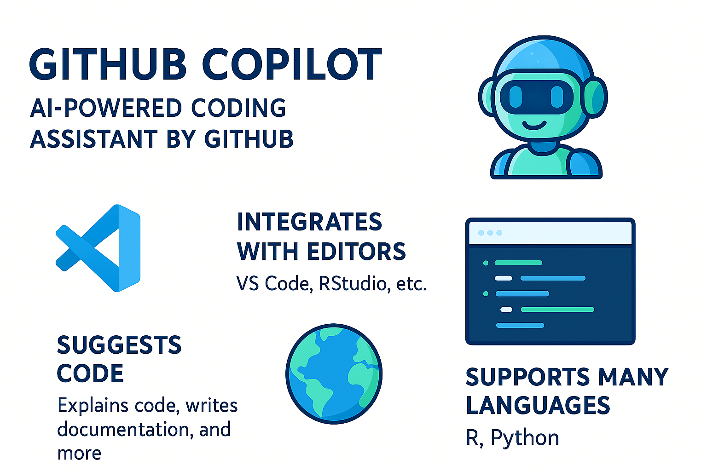
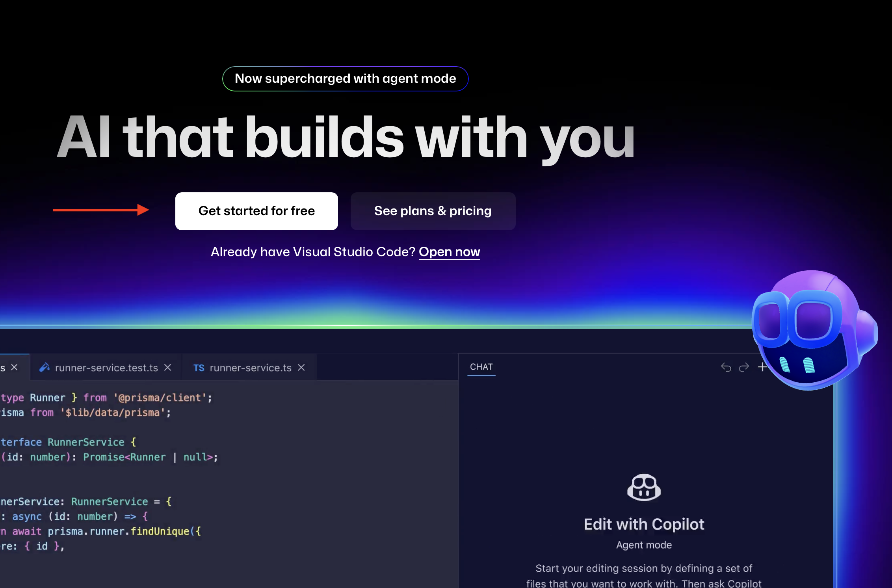
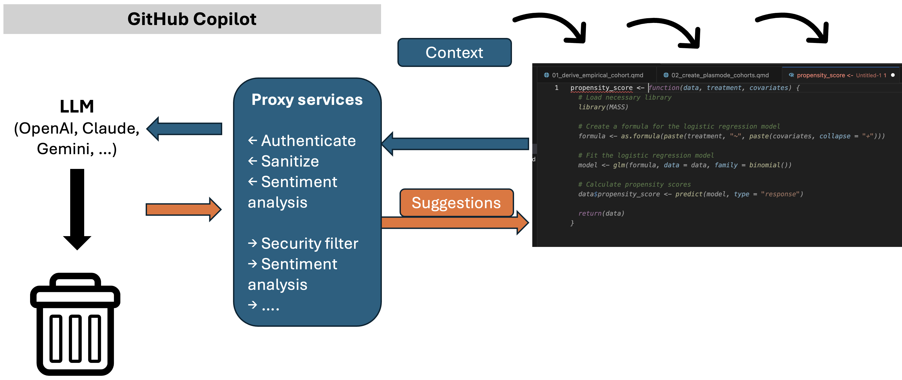
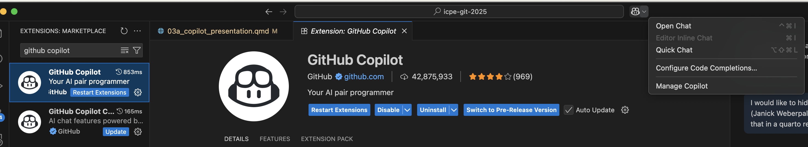
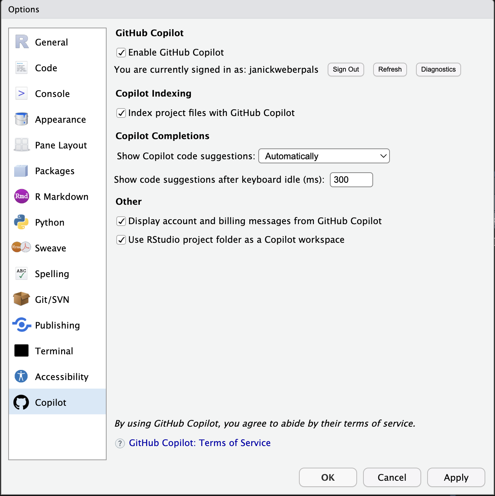
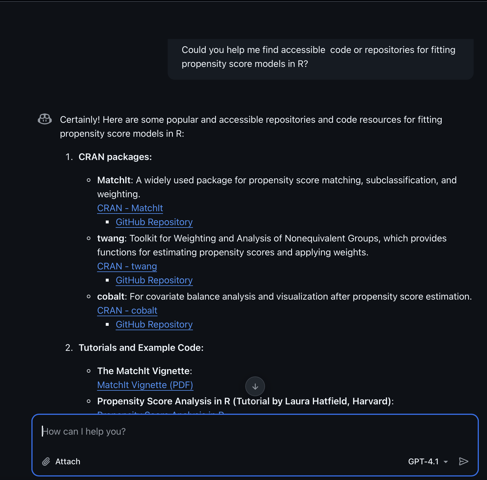

```{r}
#| label: setup
#| include: false

library(tibble)
library(gt)
```


## Poll (raise your hands)

::: incremental
-   Who uses AI assistants (ChatGPT, Gemini, Claude, Mistral, ...) on a daily basis?

-   Who uses AI assistants for code development, QC, or improving transparency and reproducibility in your research?

-   Who has ever used GitHub Copilot?
:::

# GitHub Copilot: Your AI Coding Assistant

## What is GitHub Copilot?

{#fig-copilot-info}

## Disclaimer

::: callout-important
## COI

I do not have any financial or personal relationships with Microsoft or OpenAI that could influence the content of this presentation.
:::

::: callout-caution
## Some Important Notes Before We Dive In

-   AI is developing rapidly, so will GitHub Copilot
-   Copilot is not perfect; it can make mistakes
-   Always review suggestions carefully
    -   See it as a helpful assistant/buddy, not a replacement to use your own intellect
-   Copilot does not replace human expertise (yet)
-   We will only cover the basics today
    -   If you'd be intereted in a more advanced session, let us know via the course feedback form!
:::

## How to Access Copilot

-   **Sign up:** [github.com/features/copilot](https://github.com/features/copilot)
-   **Requirements:** GitHub account (free, subscription)
-   More detailed instructions can be found [on course website (section 2)](https://janickweberpals.github.io/icpe-git-2025/syllabus.html#github-copilot)

{#fig-copilot-signup width="120%"}

## How does Copilot work?

{#fig-gh-copilot-works width="120%"}

## Where Can You Access GitHub Copilot?

-   **Visual Studio Code and GitHub Codespaces:** Popular code editor with Copilot extension
-    In VS Code: Extensions → Search "GitHub Copilot" → Install

{#fig-vscode width="100%"}

## Where Can You Access GitHub Copilot?

-   **RStudio:** Integrated with RStudio for R development

{#fig-rstudio width="100%"}

## Where Can You Access GitHub Copilot?

{#fig-github width="100%"}

# How to Use Copilot To Enhance Your Work in Pharmacoepidemiology

## Use Cases for Analytic Code

::: callout-note
### Code comprehension & review

-   Ask Copilot to explain complex code
    -   *"Line coding is too long and complex"* no longer a valid argument to not provide code along with a research study to enhance transparency and reproducibility (e.g., in peer-review)
-   Translate code between languages (e.g., R to Python)
-   Summarize code changes
-   Suggest improvements or catch potential bugs
:::

::: callout-note
### Code development, testing and documentation

-   Write new functions, scripts, or analyses faster
-   Generate boilerplate code for data import, cleaning, modeling
-   Create unit tests for your functions (!!!)
-   Suggest test cases (simulated data) and edge scenarios
-   Auto-generate docstrings, comments, and README content
:::

## Use Cases for git

::: callout-note
## GitHub Copilot for Git

-   Automate common git workflows
    -   Example: generate commit messages based on code changes (`git diff`)
-   Tracking
    -   *"What changes were made to this repository in the last 5 commits?"*
-   Staging & committing
-   Advanced usage (create branches, help with pull requests and merging, etc.)
:::

## Copilot Modes

.](images/copilot_modes.png){#fig-copilot-modes width="80%"}

## Prompt engineering

::: callout-tip
-   Start general, then get specific
    - *Write a function in R. The function should do X and Y based on Z input.*

-   Provide context and examples
    - *Return a propensity score-matched cohort in a data.frame that contains the patient ID (patid), covariates (all columns that start with "c_") and the computed propensity score as "ps"*

-   Segment complex tasks into sub-tasks
    - *First create a script called "xyz_function.R", then write the function, then test the function with dataset 1, address any potential errors and then test again*

-   Iterate on prompts based on feedback
    - *Please refactor the code such that it returns the age variable as a categori*
:::

More recommendations and examples can be found [here](https://docs.github.com/en/copilot/concepts/prompt-engineering).

## Model Choice {.fit-slide}

```{r}
#| label: tbl-model-comparison

model_comparison <- tibble::tribble(
  ~Model,            ~`Task area`,                                   ~`Excels at (primary use case)`,                                              ~`Additional capabilities`,
  "GPT-4.1",         "General-purpose coding and writing",          "Fast, accurate code completions and explanations",                          "Agent mode, vision",
  "GPT-4o",          "General-purpose coding and writing",          "Fast completions and visual input understanding",                           "Agent mode, vision",
  "o3",              "Deep reasoning and debugging",                "Multi-step problem solving and architecture-level code analysis",           "Reasoning",
  "o4-mini",         "Fast help with simple or repetitive tasks",   "Fast, reliable answers to lightweight coding questions",                    "Lower latency",
  "Claude Opus 4.1", "Deep reasoning and debugging",                "Complex problem-solving challenges, sophisticated reasoning",               "Reasoning, vision",
  "Claude Opus 4",   "Deep reasoning and debugging",                "Complex problem-solving challenges, sophisticated reasoning",               "Reasoning, vision",
  "Claude Sonnet 3.5", "Fast help with simple or repetitive tasks", "Quick responses for code, syntax, and documentation",                     "Agent mode, vision",
  "Claude Sonnet 3.7", "Deep reasoning and debugging",                "Structured reasoning across large, complex codebases",                      "Agent mode, vision",
  "Claude Sonnet 4", "Deep reasoning and debugging",                "Performance and practicality, perfectly balanced for coding workflows",   "Agent mode, vision",
  "Gemini 2.5 Pro",  "Deep reasoning and debugging",                "Complex code generation, debugging, and research workflows",                "Reasoning, vision",
  "Gemini 2.0 Flash","Working with visuals (diagrams, screenshots)", "Real-time responses and visual reasoning for UI and diagram-based tasks", "Vision"
)

model_comparison |> 
  gt() |> 
  tab_caption("Comparison of GitHub Copilot models.") |> 
  tab_footnote("Taken from https://docs.github.com/en/copilot/reference/ai-models/model-comparison") |> 
  tab_style(
    style = list(
      cell_text(weight = "bold")
      ),
    locations = cells_column_labels(columns = everything())
    )
```


## Copilot in Action (Ask Mode)

**Example use case**: Comprehend and [review existing code](https://github.com/abduazizR/PEpiwithR/blob/main/applied-example.qmd)

-   Code example taken from [Abdelaziz et al., PDS 2024](https://onlinelibrary.wiley.com/doi/10.1002/pds.5728) [@abdelaziz2024optimizing]

> "To illustrate an application of the approach, we created and **analyzed an active comparator new user cohort**. Briefly, we implemented an active comparator new user design comparing the risk of bladder cancer of sodium–glucose co-transporter 2 (SGLT-2) inhibitors and glucagon-like peptide 1 receptor agonists (GLP-1RAs) inspired by a recent study from Abrahami et al. [@abrahami2022sodium] \[...\]"

## Copilot in Action (Ask Mode)


**Example**: Comprehend and [review existing code](https://github.com/abduazizR/PEpiwithR/blob/main/applied-example.qmd)

::: callout-note
## Example prompt
*How did the author define the continuous enrollment periods.
Provide details and show me the code that was used to derive the continuous enrollment periods.*
:::

 [@abdelaziz2024optimizing]](images/ask-mode-repo-snaphsot.png){#fig-review-repository width="80%"}

## Copilot in Action (Ask Mode)



## Copilot in Action (Agent Mode)

**Example**: Simulate dataset and create a Table 1

::: callout-note
## Example prompt
Generate a simulated datasets (data.frame) using the R programming language. The simulated dataset should resemble the main characteristics and baseline distributions of a fictional randomized trial with two treatment arms and a few baseline covariates, including age (continuous: mean 65), sex (categorical: male (40%) and female (60%)), disease stage (ordinal: I, II, III, IV, with each 25% prevalence) and biomarker status (binary: TRUE (30%), FALSE (70%)).

Use a step by step approach:

1. Create a new file called “01_simulate_data.R”
2. Simulate the dataset and do not store the simulated dataset
3. Illustrate the baseline characteristics and distributions by treatment arm using the tbl_summary() function of the gtsummary package. You don’t need to execute the code
:::


## Copilot in Action (Agent Mode)



## Copilot in Action (Edit Mode)



## Copilot in Action (Git Workflow)



## Questions?

Give it a try in your next project!

-   [Overview](https://github.com/features/copilot)
-   [Documentation](https://docs.github.com/copilot)
-   [Tutorials](https://github.com/features/copilot/tutorials)

## References
