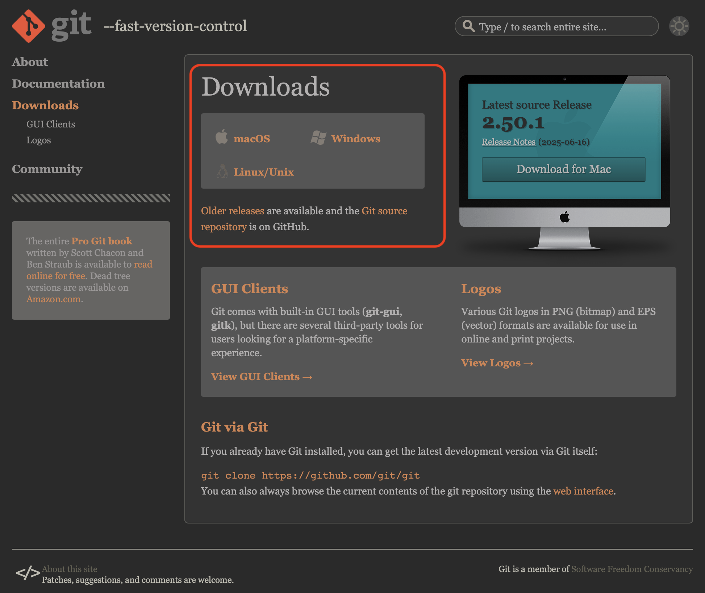
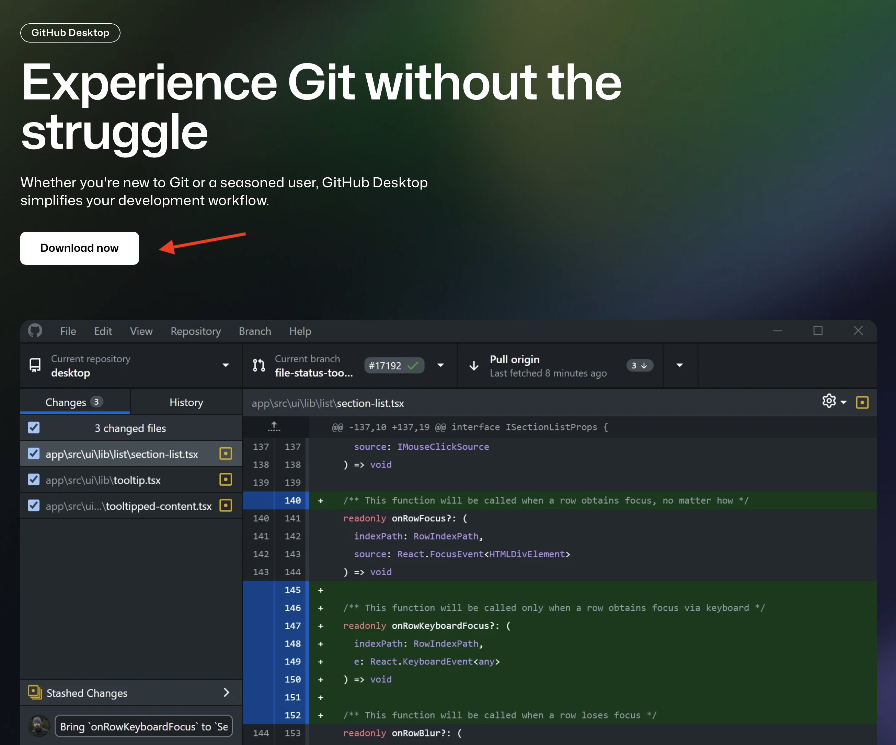
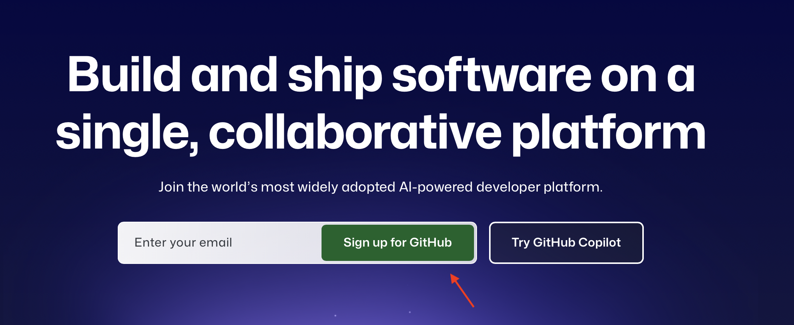
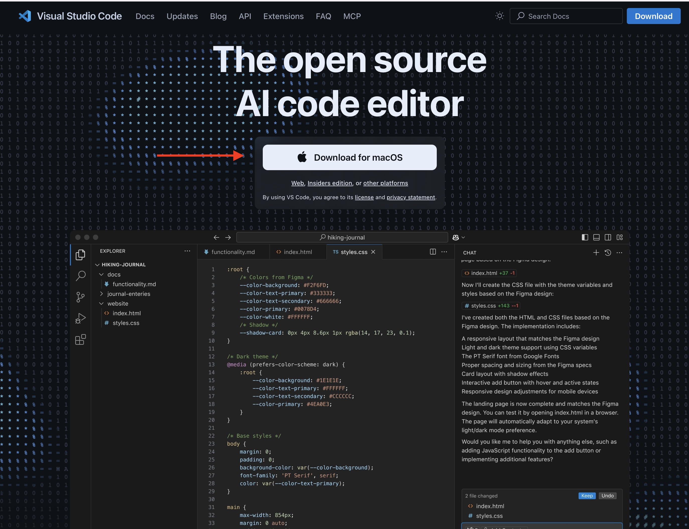
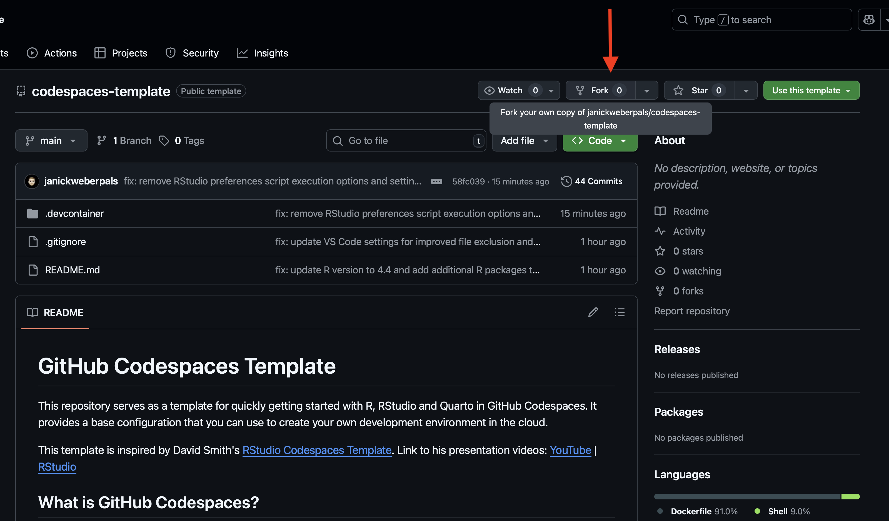
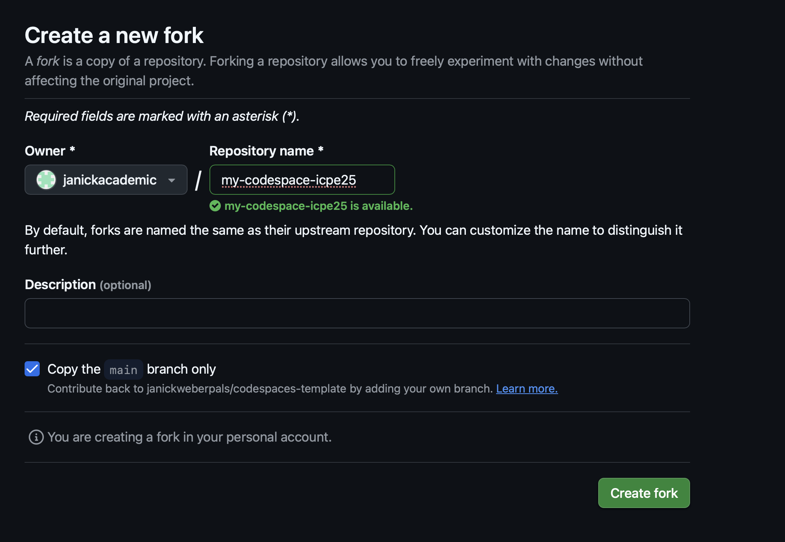
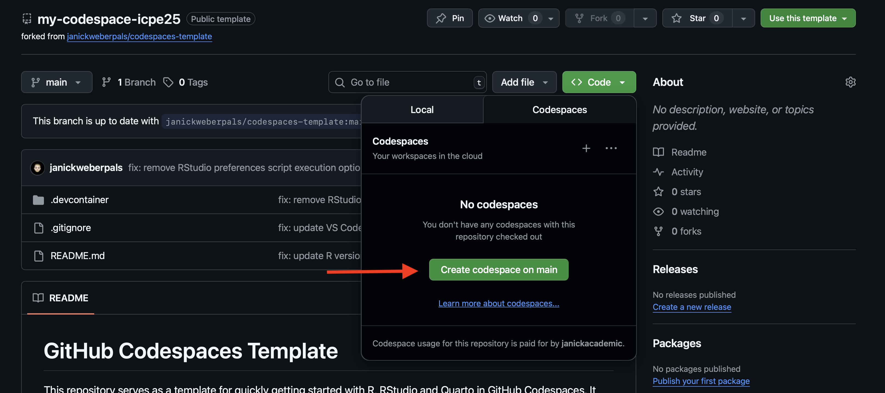

```{r}
#| label: setup
#| include: false
library(googlesheets4)
library(gt)
library(dplyr)
```

This site provides some further information on the objectives and syllabus/organization of the course.

> Course Date: August 25, 2024 (9am-12:30pm, Berlin)

## Course Objectives {.unnumbered}

Attendees of this advanced methods couse will learn how to implement transparent and reproducible workflows across the real-world evidence study lifecycle.

```{mermaid}
%%| label: fig-Objectives
%%| fig-cap: RWE study liefcycle.
flowchart TB
A(Design stage) --> B
B(Analysis execution stage) --> C
C(Reporting stage)
```

-   [**Design stage:**]{.underline} Incorporate **reproducible reporting of key study parameters at a study design and planning stage** using the HARPER protocol

-   [**Analysis stage:**]{.underline} **Version control and share analytic code at the analysis and execution stage** of the study using git and Github

-   [**Reporting stage:**]{.underline} Use **literate programming** by combining narrative language, analytic code and study results for **transparent and reproducible study reporting**

## Syllabus {.unnumbered}

In this practical hands-on course, we introduce resources and tools needed for the transparent and reproducible conduct of RWE studies following **FAIR (Findable, Accessible, Interoperable and Reproducible)** principles.

```{r}
#| label: tbl-timetable
#| tbl-cap: "Detailed course timetable"
#| message: false
#| echo: false

gs4_deauth()
read_sheet(
  ss = Sys.getenv("timetable_url")
  ) |> 
  mutate(across(c(Start, End), ~ format(as.POSIXct(.x, format = "%H:%M"), format = "%H:%M"))) |>
  mutate(Time = paste0(Start, " - ", End)) |>
  relocate(Time, .before = Topic) |>
  select(-c(Duration, Start, End)) |> 
  gt() |> 
  cols_align(align = "left")
```

## Technical Setup {.unnumbered}

This section provides some step-by-step instructions on how to install relevant software discussed and presented throughout the course.

### Download and install `git` {.unnumbered}

Git is a [free and open source](https://git-scm.com/about/free-and-open-source) distributed version control system designed to handle everything from small to very large projects with speed and efficiency. It comes as a command line software, i.e., natively there is no graphical user interface (GUI) as you may be used to from other commonly used software. However, GUI applications (which make the handling of git commands easier, especially for beginners) are available and described in @sec-github-desktop.

-   Step 1: Go to <https://git-scm.com/downloads>

-   Step 2: Download the `git` distribution for your specific operating system (Windows, MacOS, Linux) (see @fig-install-git)

{#fig-install-git}

### GitHub Desktop {#github-desktop .unnumbered}

GitHub Desktop is a free, open-source application that provides a graphical user interface (GUI) for interacting with Git and GitHub, simplifying tasks like committing, pushing, and pulling changes, as well as managing repositories. It aims to make using Git and collaborating on GitHub more accessible, especially for those who prefer not to use the command line. 

-   Step 1: Go to <https://github.com/apps/desktop>

-   Step 2: Click on **Download now** (see @fig-github-desktop)

-   Step 3: You will be prompted to the correct distribution for your specific operating system (Windows, MacOS, Linux)

{#fig-github-desktop}

### GitHub Account Setup {.unnumbered}

GitHub is **a** web-based platform that uses Git for version control and collaboration on software development projects. It allows developers to store, manage, and share code, making it easier to work together on projects and track changes. Think of it as a social coding platform and a cloud-based storage for code.

You can sign-up for a free account (which is more than sufficient enough for the purposes of this course), which gives you access to GitHub's core features including:

-   Access to GitHub Copilot

-   Unlimited repositories (to collaborate on public and private projects)

-   Integrated code reviews

-   Automated workflows (via CI/CD integrations and GitHub Actions with 2,000CI/CD minutes per month)

-   Community support

Often larger organizations such as universities and companies also have (paid) enterprise accounts which give you access to even more features. To sign up for a GitHub account, follow these steps:

-   Step 1: Go to <https://github.com>

-   Step 2: Enter the E-mail address that should be associated with your GitHub account and press **Sign up for GitHub** (see @fig-github-account-signup)

-   Step 3: Enter more details like your password to access GitHub, a username and your country and click **Create account**

{#fig-github-account-signup}

### GitHub Copilot {.unnumbered}

GitHub Copilot is a generative AI tool that functions as a coding assistant to help you write code faster and so much more.

-   Step 1: Go to <https://github.com/features/copilot>

-   Step 2: Click on **Get started for free**. Be aware that there also also paid plans (e.g., Copilot Pro) and ensure that you sign up for the free plan, which is enough to get started and explore this tool.

-   Step 3: You can use GitHub Copilot directly via a chatbot on Github.com (e.g., to learn more about code in repositories or to ask questions on existing software tools that are hosted on GitHub) or in supported IDE (Visual Studio Code, Visual Studio, RStudio, JetBrains IDEs, Azure Data Studio, Xcode, Vim/Neovim, and Eclipse)

{#github-copilot}

### Visual Studio (VS) Code {.unnumbered}

Visual Studio Code (VS Code) is a free, open-source, and highly customizable code editor developed by Microsoft. It's known for its lightweight nature, powerful features, and extensive extensibility through extensions. VS Code is used by developers for various tasks, including editing, debugging, and managing code. One of the key strengths of VS Code is its extensibility. The VS Code Marketplace offers a vast collection of extensions that add functionality for various programming languages, frameworks, and tools.

-   Step 1: Go to <https://code.visualstudio.com>

-   Step 2: The download button for your specific operating system (Windows, MacOS, Linux; see @fig-vscode-install)

-   Step 3: Follow the installation prompts that you will be guided through

{#fig-vscode-install}

### Fork the GitHub Codespaces Template {.unnumbered}

GitHub Codespaces provides cloud-powered development environments for any activity - whether it's a long-term project, or a short-term task like reviewing a pull request. You can work with these environments from Visual Studio Code or in a browser-based editor. GitHub Codespaces comes with a[ free plan for personal accounts ](https://docs.github.com/en/billing/concepts/product-billing/github-codespaces#monthly-included-storage-and-core-hours-for-personal-accounts)but can also be extended to a paid plan that comes with more storage and compute hours.

One of the core strengths is that it's cloud-based and dependencies can be dockerized, i.e., it allows researchers to create and access complete and customized development environments remotely, directly from a web browser. For example, you may be using a specific combination of a local operating system (Windows, MacOS or Linux), a specific version of a programming language (e.g., R version 4.4.1) and a suite of R packages in their respective versions. With GitHub Codespaces you can create such a highly customized environments and reproduce (even share) these at the click of a button.

We created such an environment for this course and you can access it by following these steps:

1.  Sign up for a (free) GitHub account (see @sec-github-account) and GitHub Copilot (@sec-github-copilot)
2.  Go to <https://github.com/janickweberpals/codespaces-template>
3.  Click on **Fork** (@fig-fork-1) to create a forked version on your GitHub account

{#fig-fork-1}

4.  Optional: Rename your forked version (e.g., my-codespace-ICPE25, see @fig-fork-2)

{#fig-fork-2}

5.  Go to `Code > Codespaces > Create codespace on main` (@fig-start-codespace)

{#fig-start-codespace}